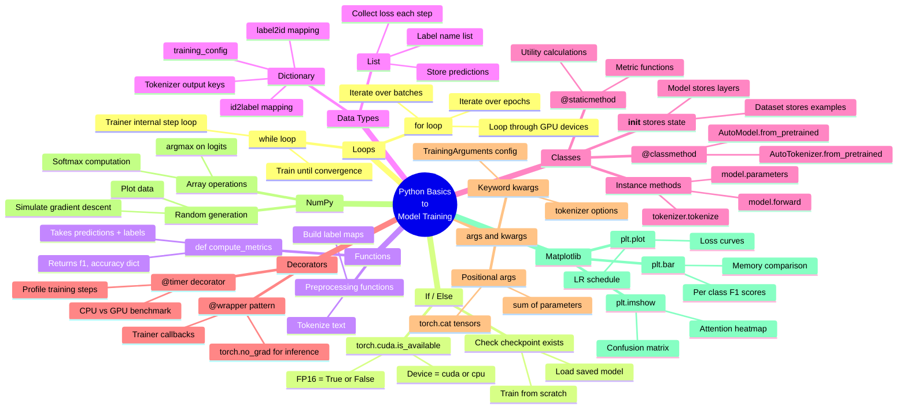
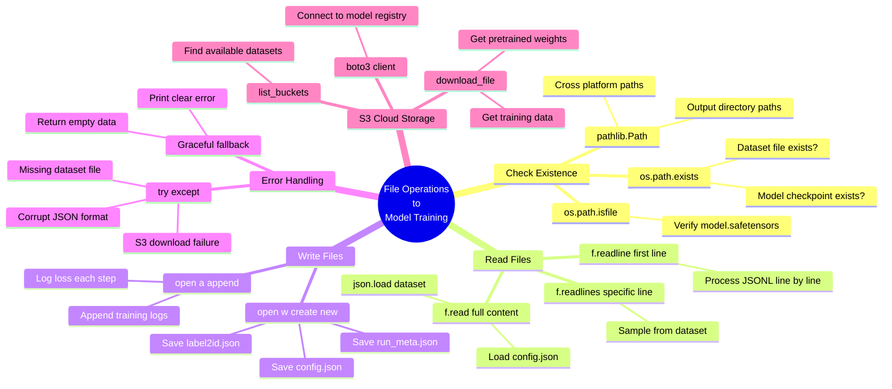

# Mind Map: Python Basics to Encoder Model Training

## 1. How Python Basics Connect to Training



## 2. How File Operations Connect to Training



## 3. Complete Training Pipeline Flow

```mermaid
flowchart LR
    subgraph basics["Python Basics"]
        loops[Loops<br>for / while]
        ifelse[If / Else]
        funcs[Functions<br>def / return]
        lists[Lists]
        dicts[Dictionaries]
        classes[Classes<br>__init__ / methods]
        decorators[Decorators<br>@wrapper]
        args[*args / **kwargs]
        numpy[NumPy]
        matplotlib[Matplotlib]
    end

    subgraph files["File Operations"]
        exists[os.path.exists<br>pathlib]
        read[read / readline<br>readlines]
        write[write / append]
        errors[try / except]
        s3[S3 / boto3]
    end

    subgraph training["Training Pipeline"]
        setup[1. Setup<br>pip install<br>GPU check]
        data[2. Load Data<br>intents.json<br>label mappings]
        tokenize[3. Tokenize<br>AutoTokenizer<br>input_ids + mask]
        model[4. Load Model<br>AutoModel<br>classification head]
        config[5. Configure<br>TrainingArguments<br>lr, epochs, fp16]
        train[6. Train<br>epoch loop<br>batch loop<br>loss.backward]
        evaluate[7. Evaluate<br>compute_metrics<br>F1, accuracy]
        visualize[8. Visualize<br>loss curves<br>confusion matrix]
        save[9. Save<br>model.safetensors<br>config.json]
    end

    ifelse --> setup
    exists --> setup
    s3 --> data
    read --> data
    dicts --> data
    classes --> tokenize
    classes --> model
    args --> model
    dicts --> config
    args --> config
    loops --> train
    decorators --> train
    funcs --> evaluate
    numpy --> evaluate
    lists --> evaluate
    matplotlib --> visualize
    write --> save
    exists --> save
    errors --> data
    errors --> save
```

## 4. Exercise to Training Connection

```mermaid
flowchart TD
    subgraph ex["exercises.ipynb"]
        e1[Ex 1: Loops]
        e2[Ex 2: If-Else]
        e3[Ex 3: Functions]
        e4[Ex 4: List]
        e5[Ex 5: Dictionary]
        e6[Ex 6: Class]
        e7[Ex 7: classmethod<br>staticmethod]
        e8[Ex 8: Decorator]
        e9[Ex 9: Timer]
        e10[Ex 10: args kwargs]
        e11[Ex 11: NumPy]
        e12[Ex 12: Matplotlib]
        e13[Ex 13: File exists]
        e14[Ex 14: Pathlib]
        e15[Ex 15: Read file]
        e16[Ex 16: Write append]
        e17[Ex 17: Error handling]
    end

    subgraph train["Model Training"]
        epochs[Epoch + Batch loops]
        gpu[GPU check + FP16]
        metrics[compute_metrics]
        history[Loss history + predictions]
        maps[label2id + id2label + config]
        modelcls[Model + Dataset + Tokenizer classes]
        pretrained[.from_pretrained]
        nograd[@torch.no_grad]
        profile[Profiling training speed]
        targs[TrainingArguments]
        logits[argmax on logits]
        plots[Loss curves + confusion matrix]
        checkpoint[Check model exists]
        paths[Output directory paths]
        loaddata[Load JSON dataset]
        savemodel[Save config + metadata]
        robust[Handle missing files]
    end

    e1 --> epochs
    e2 --> gpu
    e3 --> metrics
    e4 --> history
    e5 --> maps
    e6 --> modelcls
    e7 --> pretrained
    e8 --> nograd
    e9 --> profile
    e10 --> targs
    e11 --> logits
    e12 --> plots
    e13 --> checkpoint
    e14 --> paths
    e15 --> loaddata
    e16 --> savemodel
    e17 --> robust
```
